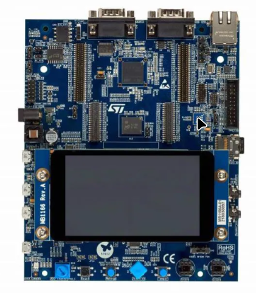

# STM32H757I-EVAL



## Default Setting Template — RTIC Base

- Dual-core STM32H757
- CM7 + CM4 firmware
- Shared SRAM4 communication
- RTIC-based application
- J-Link GDB Server
- RTT log output

## Run

```bash
chmod +x ./run-dual.sh
./run-dual.sh release

https://www.st.com/en/microcontrollers-microprocessors/stm32h745-755/documentation.html

CM7 400MHz / HCLK 200MHz / APB 100MHz
